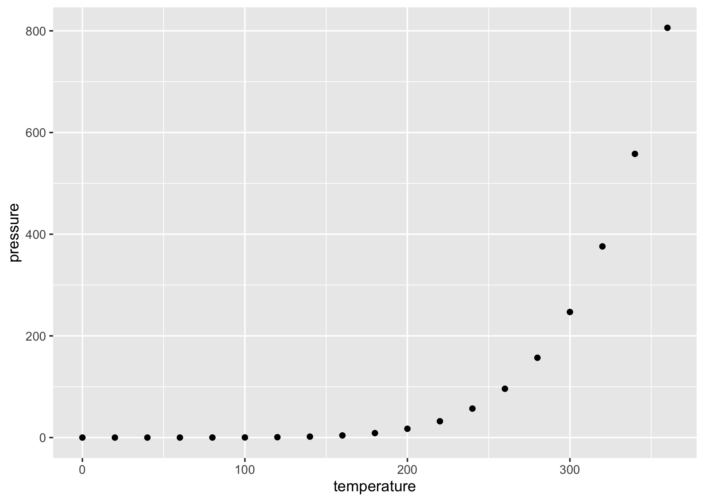

<span style='font-size: 20px'>The Problem with Demos</style>\
<span style='font-size:10px;margin-left:10px'>January 1st, 2022</style>\
<span style='font-size:10px;margin-left:10px'>Matthew Lavallee</style>\

---

Eric Carle (June 25, 1929 – May 23, 2021) was an American author, designer and illustrator of children's books.[2] His picture book The Very Hungry Caterpillar, first published in 1969, has been translated into more than 66 languages and sold more than 50 million copies. His career as an illustrator and children's book author took off after he collaborated on Brown Bear, Brown Bear, What Do You See?. He illustrated more than 70 books, most of which he also wrote, and more than 145 million copies of his books have been sold around the world.[3]

In 2003, the American Library Association awarded Carle the biennial Laura Ingalls Wilder Medal (now called the Children's Literature Legacy Award), a prize for writers or illustrators of children's books published in the U.S. who have made lasting contributions to the field. Carle was also a U.S. nominee for the biennial, international Hans Christian Andersen Award in 2010.[4]

\
 

```{r setup, include=FALSE}
knitr::opts_chunk$set(echo = TRUE)
library(ggplot2)
```

```{r cars, include=FALSE}
summary(cars)
```

```{r pressure, include=FALSE}
x<-ggplot(pressure)+geom_point(aes(x=temperature,y=pressure))
paste0(getwd(),"/thoughts_images")
ggsave(x,path = paste0(getwd(),"/thoughts_images"),filename="html.png")
```